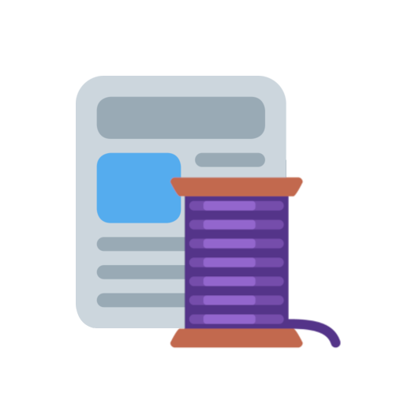

<br />
<p align="center">
  <a href="https://github.com/domino-1/discord-reaction-threads">
    
  </a>

  <h3 align="center">ReactionThreads</h3>

  <p align="center">
    🧵 A Discord Bot for creating a thread based on user reactions.  🧵
    <br />
    <a href="https://github.com/domino-1/discord-reaction-threads"><strong>Explore the docs »</strong></a>
    <br />
    <br />
    <a href="https://github.com/domino-1/discord-reaction-threads/issues">Report Bug</a>
    ·
    <a href="https://github.com/domino-1/discord-reaction-threads/issues">Request Feature</a>
    ·
    <a href="https://discord.com/oauth2/authorize?client_id=780452775070662686&scope=bot+applications.commands&permissions=122473802816">Invite Bot</a>
  </p>
</p>


<details open="open"><summary>Table of Contents</summary>
  <ol>
    <li>
      <a href="#about">About</a>
      <ul>
        <li><a href="#lingering-threads">Lingering Threads</a></li>
        <li><a href="#configuration-and-logging">Configuration and logging</a></li>
        <li><a href="#built-with">Built With</a></li>
      </ul>
    </li>
    <li>
      <a href="#self-hosting-the-bot">Self-hosting the bot</a>
      <ul>
        <li><a href="#prerequisites">Prerequisites</a></li>
        <li><a href="#getting-the-bot-running">Getting the bot running</a></li>
      </ul>
    </li>
    <li><a href="#commands">Commands</a></li>
    <li><a href="#license">License</a></li>
    <li><a href="#contact">Contact</a></li>
    <li><a href="#acknowledgements">Acknowledgements</a></li>
  </ol>
</details>


## About

ReactionThreads is a small discord bot, which expands upon Discord's Threads feature. The Bot's main use is to allow creation of threads via users reaction on a message. It listens for '🧵' reactions, and when a specific configurable number of them is reached, the bot creates a thread. (This number is set to 3 by default, but can be changed.) This means that more than one person has to show interest in a topic to create a thread, reducing the number of empty ones, and helping prevent clutter. 
The bot also comes with several other thread-related tools, such as a <code>/name</code> command for renaming new threads created by the bot. 

#### Lingering Threads

Lingering Threads are a feature of this bot, which push threads in the direction of being 'sub-channels'. They can be created using the <code>/lthread create</code> command. This makes an embed message with a button for joining the thread, opens the thread up, and pins the message. The aim with this is getting a thread that open as long as it can be, and is as easy to access as possible. Once the thread automatically archives, the button can still be used by new people to unarchive and join it, while being pinned keeps it visible. Locking (moderator-archiving) a Lingering Thread unpins and disables the join message, while deleting it removes the button altogether. 

#### Configuration and Logging

The ReactionThreads bot comes with configuration options (trough <code>/config basic ⧼options⧽</code>) and optional logging (trough <code>/config logging ⧼options⧽</code>). 
  
Configurable options are: 
* The number of reactions needed to open a thread
* The default name for threads the bot opens
* The default archive time for threads the bot opens
* The default name for threads the bot opens from NEWS type channels (usually #announcements and the like)
* The option to disabled thread creation via reactions in NEWS channels
  
Logging options are: 
* The option to turn logging on and off
* A logchannel for the bot to send logging messages to 
  Logging needs to be set to true, AND a logchannel needs to be specified for logging to work!

### Built With

* [https://nodejs.org/en/](Node.js)
* [https://discord.js.org/#/](Discord.js)

<!-- GETTING STARTED -->
## Self-hosting the bot

To get a local copy up and running, follow these simple steps.

### Prerequisites

* npm
  ```sh
  npm install npm@latest -g
  ```
  
* npm
  ```sh
  npm install discord.js
  ```

### Getting the bot running

1. Clone the repo
   ```sh
   git clone https://github.com/domino-1/discord-reaction-threads.git
   ```

2. Use the <code>/setup</code> command to get the bot up and running.

3. Use <code>!deploy guild</code> or <code>!deploy global</code> to deploy the commands. Only the application's owner can perform these. You can use <code>!unregister guild</code> to unregister guild level commands. 


## Commands

#### General commands:
/setup - Initial bot setup command. This must be performed for the bot to work.

/name - Sets the name of a thread. This command can only be used by thread creators, and only withing the first 50 messages in a thread.

/info - General information and bot commands.

#### Config command:
/config basic - Bot configuration options
· reactions - The number of reactions needed to open a thread
· threadname - The default name for threads the bot opens
· archivetime - The default archive time for threads the bot opens
· newsthreadname - The default name for threads the bot opens from NEWS type channels (usually #announcements and the like)
· restrictnews - The option to disabled thread creation via reactions in NEWS channels

/config logging - Bot logging options
· logging - The option to turn logging on and off
· logchannel - A logchannel for the bot to send logging messages to

Logging needs to be set to true, AND a logchannel needs to be specified for it to work!

#### Lingering Threads:
/lthread create - Creates a Lingering Thread
· name - The thread's name
· description - The descriptiont text in the embed message

/lthread edit - Edits an existing Lingering Thread (message and thread)
· thread - The Lingering Thread to edit. This does not need to be set if the command is done inside an lthread.
· name - The Lingering Thread's new name.
· description - The Lingering Thread's new description.


## License

Distributed under the MIT License. See `LICENSE` for more information.


## Contact

Discord: domino#3355
Email: domino.jatek@gmail.com

Project Link: [https://github.com/domino-1/discord-reaction-threads](https://github.com/domino-1/discord-reaction-threads)


<!-- ACKNOWLEDGEMENTS -->
## Acknowledgements

ReactionThread's logo was made using Twemoji emoji files: 
* [https://twemoji.twitter.com/](https://twemoji.twitter.com/)

This bot would not have been possible without the amazing Discord.js documentation and guides, and the Discord.js discord: 
* [https://discord.js.org/#/docs/main/stable/general/welcome](https://discord.js.org/#/docs/main/stable/general/welcome)
* [https://discordjs.guide/#before-you-begin](https://discordjs.guide/#before-you-begin)
* [https://discord.com/invite/djs](https://discord.com/invite/djs)

This README was created using the template at [https://github.com/othneildrew/Best-README-Template](https://github.com/othneildrew/Best-README-Template)

